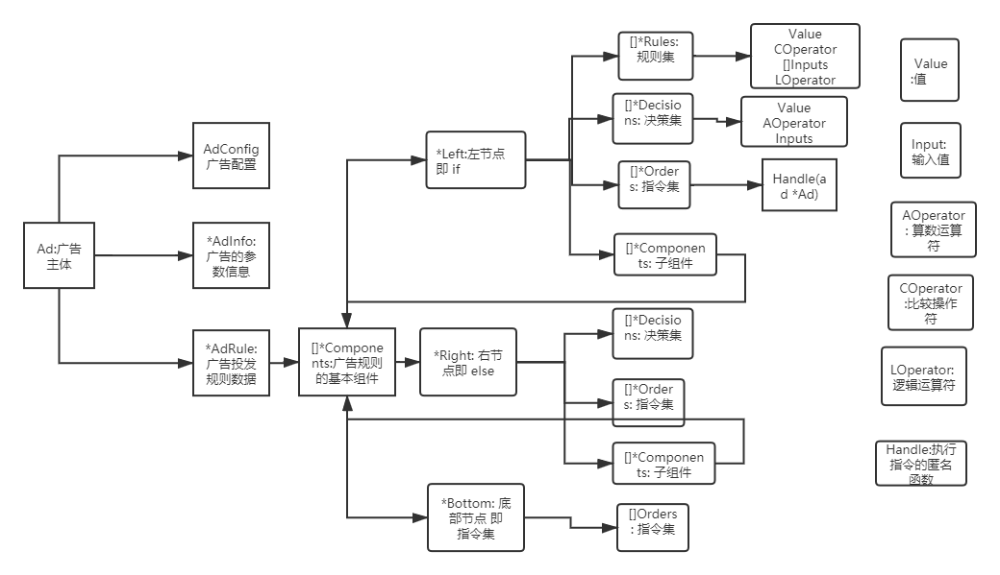

### autoaddmn(广告决策自动化)

#### 包结构
```text
├─ad.go :广告主体
├─adinfo.go :广告参数信息
├─adrule.go :广告规则
├─compare.go :比较
├─components.go :基础组件
├─decision.go :决策
├─error.go : 定义了所有的错误
├─input.go :输入
├─kernel.go :核心
├─operator.go :操作符
├─order.go :指令
├─rule.go :规则
├─value.go :值
└README.md : readme
```

#### 须知
* Rule: 规则
* Decision: 决策
* Order: 指令
* 左节点: if
* 右节点: else
* 底部节点: 一些匿名函数组成的指令集
* 当程序发现某些节点没有值时，会出入日志到stdout
#### 结构关系
* Slot 定义在 adinfo.go 中，如果添加，修改 请自行添加
* value.go 中的 Slot 用来匹配具体是AdInfo中的哪个结构体数据
* value.go 中的 ValueType用来标记Slot匹配后 value的值类型 包含( OI:int,OF:float,OD:日期,OMD:多个日期)
* Input输入的价格和定义的单位为 分, Input输入的时间单位为: 分钟
* 目前不支持 逻辑运算符 ! (没有替换的)
```go
// 值类型
type ValueType string

const (
    OI  ValueType = "int"
    OF  ValueType = "float64"
    OD  ValueType = "date"
    OMD ValueType = "mul_date"
)

// 符号标识
type ComparisonOperator string

const (
    EQ      ComparisonOperator = "="
    GT      ComparisonOperator = ">"
    GET     ComparisonOperator = ">="
    LT      ComparisonOperator = "<"
    LET     ComparisonOperator = "<="
    BETWEEN ComparisonOperator = "in"
)

// 逻辑操作符类型
type LogicOperatorType string

// 逻辑操作符
const (
    // 与
    AND LogicOperatorType = "&&"
    // 或
    OR LogicOperatorType = "||"
    // 非
    //NOT LogicOperatorType = "!"
)

// 算数运算符类型
type ArithmeticOperator string

const (
    ADD ArithmeticOperator = "+"
    SUB ArithmeticOperator = "-"
    Per ArithmeticOperator = "%"
)

// 接收 Ad 广告数据
type Handle func(ad *Ad) error

```



#### 执行流程
> 可参考 dmn_test.go
###### 数据格式化阶段
> 指令是 接收 Ad 广告数据的匿名函数
> type Handle func(ad *Ad) error
* 1.获取广告配置(Ad.AdConfig)
```go
    //1.实例化ad
    ad := NewAd()

    //1.fake 广告配置
    ad.AdConfig = AdConfig{
        SpID: "12",
        GhID: "12",
        AdID: "123",
        Name: "广告名",
    }
```
* 2.获取广告参数(Ad.AdInfo)
```go
    //2.抓取数据,需要自己获取
    ad.AdInfo = &AdInfo{
        AdRuleEnableTime: AdRuleEnableTime{Start: "2020-09-09 02:02:02", End: "2020-11-09 02:02:02"},
        AdKeepPutTime:    AdKeepPutTime{Value: 100},
        AdLeastTime:      AdLeastTime{Value: 200},
        AdSpeedRate:      AdSpeedRate{Value: 300},
        AdConvCost:       AdConvCost{Value: 400},
        AdCurCost:        AdCurCost{Value: 500},
        AdExpoSpeed:      AdExpoSpeed{Value: 600},
        AdDayCost:        AdDayCost{Value: 700},
        ACR:              ACR{Value: 800},
        Account:          Account{Value: 900},
    }
```
* 3.获取该广告的规则(Ad.AdRule), 因为逻辑运算符(&& ||) 是两两比较,所有最后一个rule 不需要 LogicOperatorType
```go
    // 3.获取规则数据
    // 3.获取规则数据
    adrule := NewAdRule()

    // 从数据库中获取，这里是fake一些数据
    // 将规则数据放入组件中
    component := FakeRuleComponent()

    adrule.Set(component)

    ad.AdRule = adrule
```
去掉最后一个rule的 LOperator
```go
    leftRule1 := &Rule{
        Value: Value{
            Slot:      AdSpeedRateSlot,
            ValueType: OI,
        },
        COperator: GT,
        Inputs: []Input{{
            Value: "12",
        }},
        LOperator: AND,
    }

    leftRule2 := &Rule{
        Value: Value{
            Slot:      AdLeastTimeSlot,
            ValueType: OF,
        },
        COperator: LET,
        Inputs: []Input{{
            Value: 10,
        }},
    }

```
* 4.格式化获取的数据与规则数据

###### 执行解析
> 只有左节点的Rules 是必须的，其他的都是可选项（包括左节点/右节点的 决策和指令,子组件 底部指令)
* 5.执行入口 Kernel->Startup(ad *Ad) error
```go
    //4. 开始解析
    kernel := NewKernel()
    err := kernel.Startup(ad)
    if err != nil {
        
```
* 6.处理 Kernel->handle(components []*Components, ad *Ad) error {

```go
    err := k.handle(ad.AdRule.Components, ad)
    if err != nil {
        return err
    }
```
* 7.优先检测左节点的规则信息
```go
      //左节点解析规则
        leftCompared, err := parse.ParseRules(v.Left.Rules, ad)
        if err != nil {
            return errors.Wrap(err, CouldNotParseRulesErr.Error())
        }
```
* 8.在Parse中解析左节点,根据Value的Slot 获取到对应的值，对值进行比较，获取到一个bool结果, 并把比较的结果放入到compared，把每个规则的逻辑运算符放入logicBox，去掉最后一个空的
```go
func (p *Parse) ParseRules(rules []*Rule, ad *Ad) (bool, error) {
```
* 9.假如有且左节点解析规则为true , 执行左节点的Decisions 和 Orders，有子组件Components时，迭代子组件
* 10.否则 假如有右节点 执行右节点
* 11.执行底部指令集
* 12.判断err

